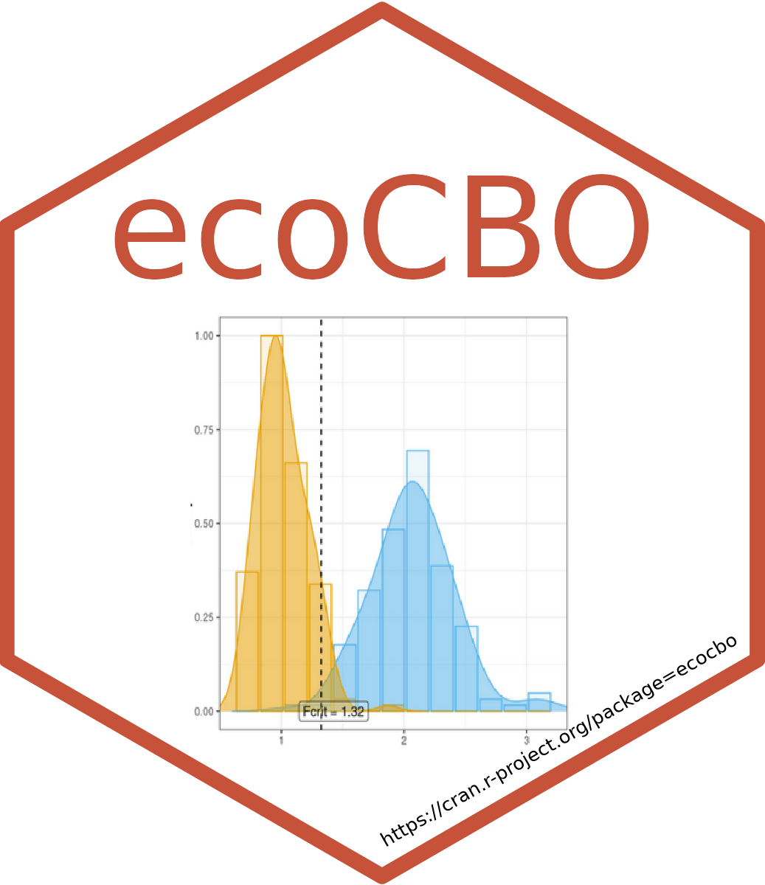

<!-- README.md is generated from README.Rmd. Please edit that file -->

# ecocbo <a href="https://cran.r-project.org/package=ecocbo"></a>

<!-- badges: start -->

[](https://github.com/arturoSP/ecocbo/actions/workflows/R-CMD-check.yaml)
[](https://github.com/arturoSP/ecocbo/blob/master/LICENSE.md)
[](https://cran.r-project.org/package=ecocbo)
[](https://github.com/arturoSP/ecocbo/tree/master)


<!-- badges: end -->

## Calculating Optimum Sampling Effort in Community Ecology

**ecocbo** is an R package that helps scientists calculate the optimum
sampling effort for community ecology projects. The package is based on
the principles developed in the
[SSP](https://github.com/edlinguerra/SSP) package, which simulates
ecological communities by extracting and using parameters that control
the simulation. The simulated communities are then compared with
PERMANOVA to estimate their components of variation and consequently the
optimal sampling effort.

**ecocbo** is a valuable tool for scientists who need to design
efficient sampling plans. The package can help scientists to save time
and money by ensuring that they collect the minimum amount of data
necessary to achieve their research goals.

## Installation

You can easily obtain ‘ecocbo’ from CRAN:

``` r
install.packages("ecocbo")
```

Alternatively, you can install the development version of ecocbo from
[GitHub](https://github.com/):

``` r
install.packages("devtools")
devtools::install_github("arturoSP/ecocbo")
```

## Example

This is a basic example which shows you how to use the different
functions in the package:

### Prepare the data

``` r
# Load data and pre-process it.
data(epiDat)

simResults <- prep_data(data = epiDat, 
                        type = "counts", Sest.method = "average",
                        cases = 5, N = 100, sites = 10,
                        n = 5, m = 5, k = 30,
                        transformation = "none", method = "bray",
                        dummy = FALSE, useParallel = FALSE,
                        model = "single.factor")
```

### Calculate components of variation.

``` r
compVar <- scompvar(data = simResults)
compVar
#>     Source Est.var.comp
#> 1        A   0.07320045
#> 2 Residual   0.32940570
```

### Determine optimal sampling effort

The sampling effort can be evaluated depending on an economic budget
(ct) or desired precision level (multSE), depending on the proposed
parameter, the function will calculate optimal values for number of
treatments (bOpt) and replicates (nOpt).

``` r
cboCost <- sim_cbo(comp.var = compVar, ct = 20000, ck = 100, cj = 2500)
cboCost
#>   nOpt
#> 1  200
```

``` r
cboPrecision <- sim_cbo(comp.var = compVar, multSE = 0.10, ck = 100, cj = 2500)
cboPrecision
#>   nOpt
#> 1   32
```

## Additionally…

### Calculate statistical power

``` r
betaResult <- sim_beta(simResults, alpha = 0.05)
betaResult
#> Power at different sampling efforts (m x n):
#>       n = 2 n = 3 n = 4 n = 5
#> m = 2  0.25  0.41  0.76  0.89
#> m = 3  0.53  0.72  0.95  0.94
#> m = 4  0.39  0.85  0.95  0.99
#> m = 5  0.61  0.93  1.00  1.00
```

### Plot the power progression as sampling increases.

``` r
# This plot will look different in every simulation
plot_power(data = betaResult, n = NULL, m = 3, method = "power")
```


## R packages required for running ecocbo

- Required: SSP, ggplot2, ggpubr, sampling, stats, rlang, foreach,
  parallel, doParallel, doSNOW, vegan

- Suggested: knitr, rmarkdown, testthat

## Participating institutions


